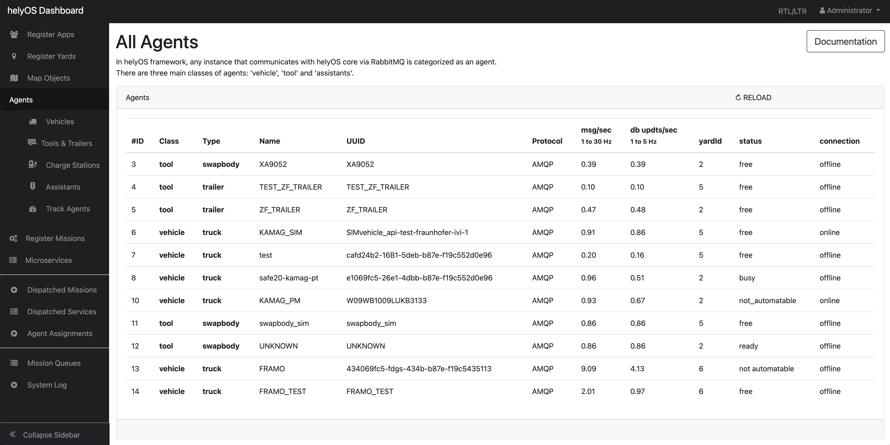

# HelyOS Core

<div id="top"></div>

<br />
<div align="center">
  <a href="https://github.com/">
    
  </a>

  <h3 align="center">helyOS Core</h3>

  <p align="center">
    Microservice and Assignments Orchestrator for the helyOS framework.
    <br />
    <a href="https://helyosframework.org">
    <strong>Official site </strong></a>
    <br />
    <br />
    <a href="https://helyos-manual.readthedocs.io/en/latest/"> Explore the docs </a>
    ·
    <a href="https://github.com/helyOSFramework/helyos_core/issues">Report Bug</a>
    ·
    <a href="https://github.com/helyOSFramework/helyos_core/issues">Request Feature</a>
  </p>
</div>


## Table of Contents
- [About The Project](#about-the-project)
- [Features](#features)
- [Built With](#built-with)
- [Demo](#demo)
- [Installation](#installation)
- [Migration to new versions](#migration-to-new-versions)
- [Contributing](#contributing)
- [How to Cite](#how-to-cite)
- [License](#license)

## About The Project

helyOS Core is a microservice and assignment orchestrator for mission-controlled agents. 
It is part of the helyOS, a software framework developed by Fraunhofer Institute for Transportation and Infrastructure Systems (IVI) for autonomous driving applications in delimited areas.

This repository contains the server source code which includes, GraphQl server, the microservice and assignments orchestrators, the database schema, and the dashboard web app used to configure helyOS Core. 
The helyOS Core is licensed under a [modified version of Apache License 2.0](./LICENSE.txt).

## Features

- **Mission Request Processing:** Handle mission requests through HTTP.
- **Microservice Orchestration:** Efficiently synchronize microservices with assignment dispatches.
- **Admin Dashboard:** Accessible web application for defining missions and agent registration.
- **GraphQL Integration:** Employ GraphQL for a flexible application interfacing.
- **Push Notifications:** Real-time notifications facilitated via WebSockets.
- **RabbitMQ Account Management:** Automated configuration and maintenance of accounts within the RabbitMQ server.
- **Agent Monitoring:** Monitor and manage the data flow of agents within the RabbitMQ server environment.


## Built With

- [Node.js](https://nodejs.org/)
- [PostGraphile](https://www.graphile.org/postgraphile/)
- [amqplib](https://amqp-node.github.io/amqplib/)
- [Socket.io](https://socket.io/)
- [pg](https://node-postgres.com/)

## Demo

Check out the [Autotruck](https://github.com/helyOSFramework/logistics-center-demo) repository for a demonstration of the helyOS Core in action. 
This demo showcases the use of helyOS Core in the integration of logistics center application.

## Tutorials and Documentation 

- [Official Website](https://helyosframework.org): Visit the official website for more information about helyOS framework.
- [Developer Manual](https://helyos-manual.readthedocs.io/en/latest/): Access the developer manual to learn how to use and configure helyOS Core.
- [Web App for helyOS Tutorial](https://fraunhofer-ivi-helyos-frontend-example.readthedocs.io/en/latest/index.html): Integrate your web app with helyOS Core.
- [IEEE Article](https://ieeexplore.ieee.org/document/10039276): Read the original IEEE article that introduces the helyOS framework.

## Installation

While the helyOS Core can be directly hosted on a Linux machine using Node.js (check out the folder `/scripts`), the easiest way to run the server is using the Docker image, as demonstrated in the `demo/docker-compose.yml` file.
You can build your own image using `packaging/build.sh` or retrieve it from [Docker Hub](https://hub.docker.com/r/helyosframework/helyos_core/tags). When the helyOS core is running locally, you should be able to access the dashboard at http://localhost:8080 and the GraphQL interactive interface at http://localhost:5000/graphiql.


<p align="center">
  
</p>
<p align="center">Dashboard at localhost:8080</p>


Find more information at [helyOS Manual](https://helyos-manual.readthedocs.io/en/latest/2-helyos-configuration/getting-started.html). 

## Building new image

Edit and run `packaging/build.sh` to build a new docker image.

## Migration to new versions

When a new version of `helyos_core` is released and the database schema has changed, you have two options: either delete your database and start the new `helyos_core` instance from scratch, or perform a database migration.

There are several migration strategies available. Here, we provide a basic one:

1. Use the `helyos_database/db_commands/pre_migration.sh` script to backup the content of all tables and drop the original tables.
2. Recreate all table structures using the new schema from the new `helyos core` version.
3. Use the `helyos_database/db_commands/post_migration.sh` script to populate the new table structures using the backed-up data. Only tables and fields that match will be copied.

You can customize the data transformation or parametrized data initialization in the `pre_migration.sh` and `post_migration.sh` scripts. If you are using the helyOS Core Docker image, map these files to your machine using the volume options in the `docker-compose` file.


To run this migration strategy, you can restart your application with the enviroment variable RUN_MODE="migration" or simply run the the following command 
in the terminal:


```bash
    docker compose run --rm helyos_core_service "/usr/local/helyos_core/helyos_database/db_commands/migrate.sh" 
```

Note that when migrating to a new database schema, it is crucial to assess how these changes will impact the application. 
It is recommended to backup your data before performing any migration.
While the provided migration strategy is a basic one, developers have the flexibility to develop a more refined strategy based on their specific requirements.


## Contributing

See [CONTRIBUTING.md](./CONTRIBUTING.md).

Questions about contributing, internals and so on are very welcome on the [mailing list](https://github.com/helyOSFramework/helyos_core/discussions).


## How to Cite

If you find the helyOS framework useful for your research or work, we kindly request that you cite the following paper:

C. Viol Barbosa, N. Belov, F. Keppler, J. Kolb, G. Nitzsche and S. Wagner, "helyOS: A customized off-the-shelf solution for autonomous driving applications in delimited areas," 2023 IEEE/SICE International Symposium on System Integration (SII), Atlanta, GA, USA, 2023, pp. 1-6, doi: 10.1109/SII55687.2023.10039276.

We appreciate your support and contribution to the helyOS community!


### License

The helyOS Core is licensed under a modified Apache License 2.0. For more details, please refer to the [LICENSE](./LICENSE.txt) file.

